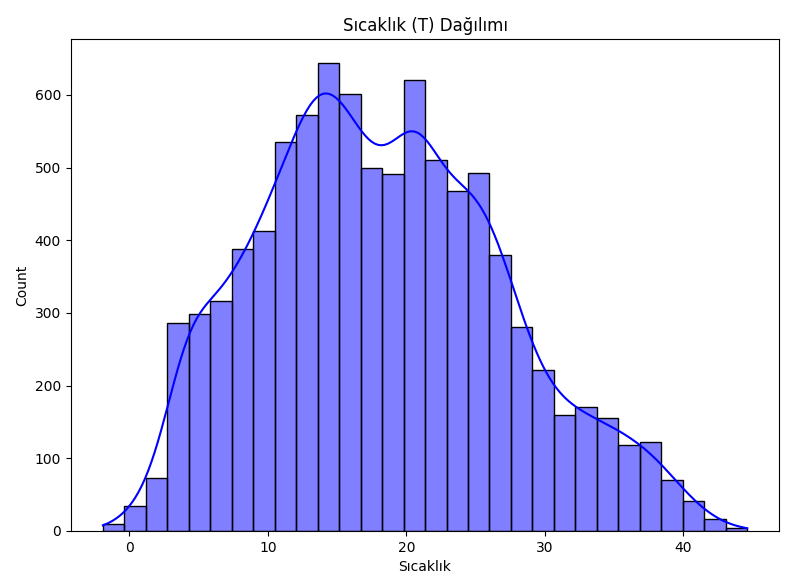
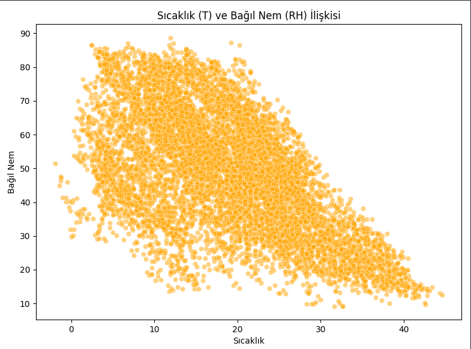
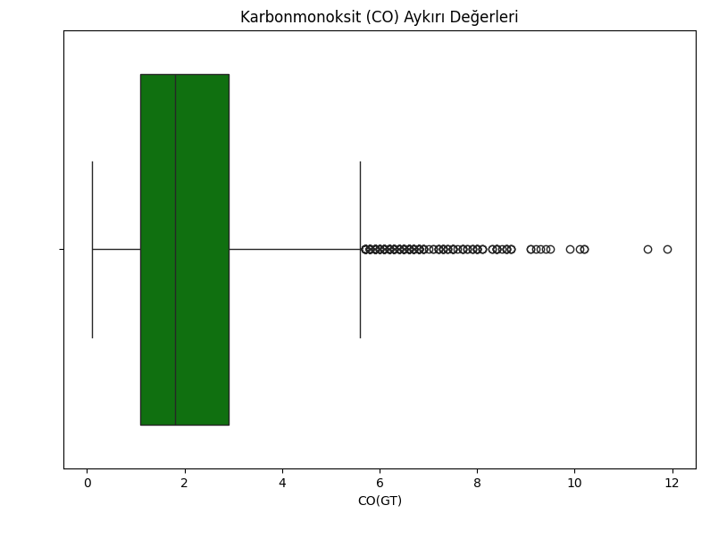
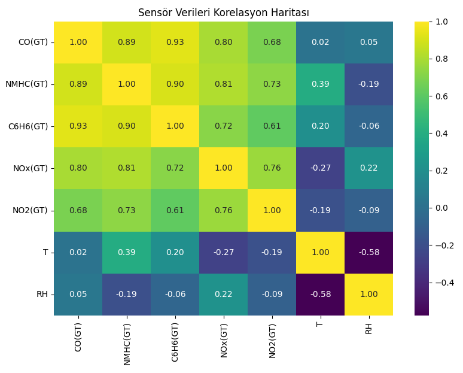
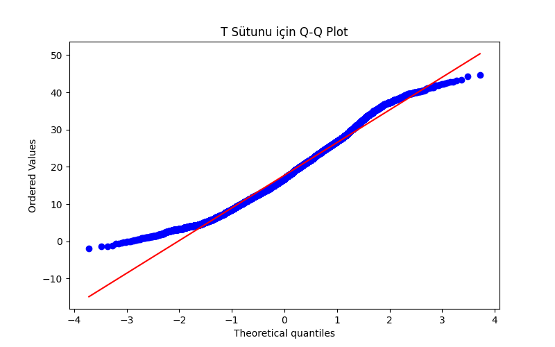

# Air Quality Data Statistical Analysis and Anomaly Detection Report

This report contains the results of the Exploratory Data Analysis (EDA) and Statistical Anomaly Detection operations performed on the `AirQualityUCI.csv` dataset.

## 1. Data Preprocessing and Summary
Values of `-200`, representing moments when the devices were turned off or malfunctioning, were cleaned, making the dataset suitable for modeling and statistical analysis.
* The `NMHC(GT)` column, which was 90% missing from the original dataset, was completely removed.
* **Cleaned Data Shape:** 6941 rows, 12 columns.

---

## 2. Exploratory Data Analysis (EDA) Plots

### 2.1 Temperature (T) Distribution
When we examine the general distribution of the temperature data, it shows a profile close to a bell curve (normal distribution), though a slight right skew is noticeable.

### 2.2 Temperature (T) and Relative Humidity (RH) Relationship
Looking at the scatter plot between temperature and relative humidity, there is a distinct negative (inverse) correlation, indicating that as temperature increases, the relative humidity ratio drops.

### 2.3 Carbon Monoxide (CO) Outliers
When carbon monoxide values are examined with a boxplot, it is observed that the vast majority of the measurements are clustered at normal levels (inside the green box). However, sudden and dangerous spikes (outliers) shooting up to levels around 12 occur from time to time.

### 2.4 Sensor Data Correlation Heatmap
According to the heatmap showing the statistical relationships between different sensor measurements, there are strong positive correlations between `C6H6(GT)` and other gas sensors. Conversely, there is a strong inverse relationship at a level of **-0.58** between `T` (Temperature) and `RH` (Relative Humidity).

---

## 3. Statistical Analysis (Temperature - 'T' Column)

### 3.1 Normal Distribution Parameters
The basic population parameters calculated over the temperature data are as follows:
* **Mean ($\mu$):** [Mean Value from Output, e.g., 18.31]
* **Standard Deviation ($\sigma$):** [Standard Deviation Value from Output, e.g., 8.82]

### 3.2 68-95-99.7 (Empirical) Rule Check
After the Z-score transformation, the distribution of the data within the standard deviation intervals occurred as follows:
* **$\pm1$ Standard Deviation (Expected ~68%):** %[Value from Output]
* **$\pm2$ Standard Deviations (Expected ~95%):** %[Value from Output]
* **$\pm3$ Standard Deviations (Expected ~99.7%):** %[Value from Output]
*(Note: The closer these results are to theoretical expectations, the more normally distributed the data is considered to be.)*

---

## 4. Normality Tests

### 4.1 Shapiro-Wilk Test
* **Test Statistic:** [Statistic Value from Output]
* **P-Value:** [P-Value from Output]
* **Result:** Since the p-value is less than 0.05, the $H_0$ hypothesis is rejected (The data does not perfectly fit a normal distribution).

### 4.2 Q-Q Plot
The Q-Q plot visually confirms that the data shows a fairly good fit to the theoretical normal distribution (the red line) in the center, but deviates from normality at the extreme points (the tails) of the graph.

---

## 5. Confidence Intervals and Anomaly Detection

### 5.1 95% Confidence Interval
The interval in which the population mean is located with a 95% probability (calculated via Standard Error) is as follows:
* **Confidence Interval:** `([Lower_Bound_Value], [Upper_Bound_Value])`

### 5.2 Anomaly Detection ($|Z| > 3$)
In the temperature data, unusual measurements where the absolute value of the Z-score is greater than 3 (meaning they fall more than 3 standard deviations away from the mean) are labeled as "anomalies".
* **Number of Detected Anomalies:** [Anomaly Count from Output]